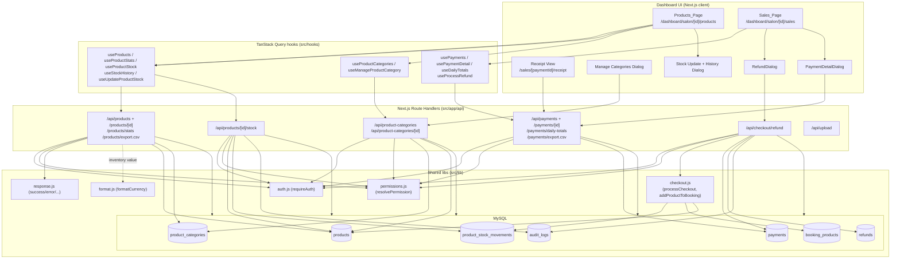
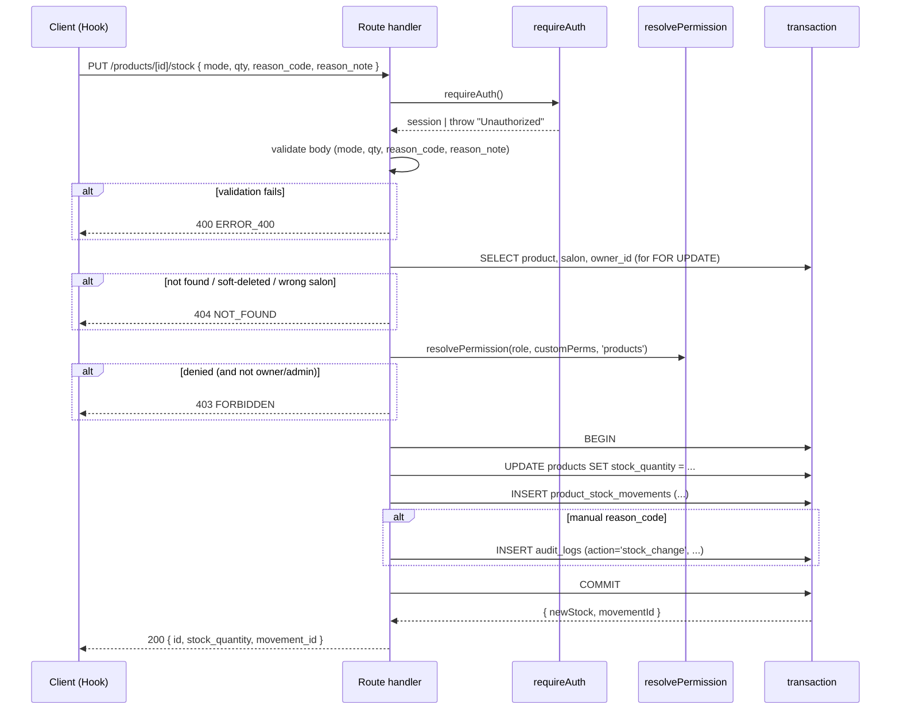
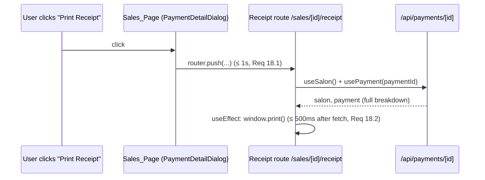

# Design Document

## Overview

This design overhauls the salon dashboard's **Products** and **Sales** pages so they
behave as a real per-salon inventory system and a real per-salon ledger. The work is
scoped to two existing pages:

- `/dashboard/salon/[salonId]/products` (Products_Page)
- `/dashboard/salon/[salonId]/sales` (Sales_Page)

and to the existing API surfaces under `/api/products`, `/api/products/[productId]`,
`/api/payments`, `/api/payments/[id]`, `/api/checkout/refund`, plus three new resources:

- `/api/products/[productId]/stock` (Stock_API — list + adjust + history)
- `/api/products/stats`, `/api/products/export.csv`
- `/api/product-categories`, `/api/product-categories/[id]` (Categories_API)
- `/api/payments/daily-totals`, `/api/payments/export.csv`
- A new browser-printable receipt view at
  `/dashboard/salon/[salonId]/sales/[paymentId]/receipt`.

The design is grounded in what the codebase actually has today:

- Auth is JWT via `@/lib/auth.js` (`requireAuth()`, `getSession()`).
- Authorization defaults flow through `@/lib/permissions.js` (`resolvePermission`,
  `canAccessPage`). The keys `products`, `sales` already gate the pages.
- Standard JSON envelopes come from `@/lib/response.js` (`success`, `error`,
  `unauthorized`, `forbidden`, `notFound`, `created`, `noContent`).
- The DB layer is `@/lib/db.js` (`query`, `getOne`, `transaction`).
- All money is rendered through `@/lib/format.js#formatCurrency(amount, currency)`.
- The canonical money/inventory entry points stay in `@/lib/checkout.js`
  (`calculateBookingTotal`, `addProductToBooking`, `processCheckout`).
- TanStack Query is the data layer; `usePayments`, `useProducts`, `useProcessRefund`,
  `useUpdateProductStock` are the hooks the UI calls.
- The UI is shadcn/ui + Tailwind; framer-motion for the existing card/table animations.
- Recharts is already a dependency; the daily revenue chart uses it.

The design's main structural moves are:

1. **Status vocabulary unification** — UI, API, and DB all use
   `('pending','paid','refunded','partially_refunded')`. The current UI uses
   `'completed' / 'partial_refund'`, which the DB never stores. The migration only
   adds `'partially_refunded'` to the enum; no rows are touched.
2. **Field name unification** — every field the dashboard reads becomes snake_case at
   the API boundary (`client_name`, `booking_id`, `booking_datetime`, `created_at`,
   `stripe_payment_id`). The current API mixes camelCase, which silently breaks the
   page.
3. **Server-side filtering** — date, method, status, search, category, stock, active,
   sort, page, limit all move server-side. The current page filters client-side and
   the API ignores `salon_id` for owners.
4. **Audit trail** — every refund and every manual stock change writes one row to
   `audit_logs`, in the same DB transaction as the originating change. Sale-driven
   stock changes use the existing booking/payment audit trail; only manual stock
   movements create audit_logs entries.
5. **Stock movement log** — a new table `product_stock_movements` records every
   stock change with `before/after/delta/reason_code/performed_by`. The checkout
   flow writes a `'sale'` movement; refunds write a `'refund'` movement. The
   Products_Page exposes a "Stock history" view per product.
6. **Real per-salon categories** — the `product_categories` table, which already
   exists but is dead code, becomes the only source of categories. The
   `PRODUCT_CATEGORIES` hardcoded constant in `use-products.js` is removed.
7. **Currency consistency** — every monetary render passes `salon.currency`. The
   current Products and Sales pages call `formatCurrency(amount)` (single arg) in
   places, which silently uses the DZD default. The `RefundDialog` hardcodes `$`,
   which is forbidden after this change.
8. **Browser-printable receipt** — a new `/sales/[paymentId]/receipt` route
   triggers `window.print()` after data load. Email receipt button is removed.

What this design does NOT do (carried forward from Requirement 23):

- No walk-in (booking-less) POS flow. `payments.booking_id` stays `NOT NULL UNIQUE`.
- No CSV import / bulk operations / per-staff cashier filter / cashier column on
  payments.
- No Stripe Connect or marketplace product changes.
- No email/SMS receipt channel — print only.

## Architecture

### High-level component map



### Module placement (Next.js App Router)

```
src/app/api/
  products/
    route.js                       (existing — secured, paginated, sorted)
    stats/route.js                 (NEW)
    export.csv/route.js            (NEW)
    [productId]/
      route.js                     (existing — perms aligned, soft-delete)
      stock/route.js               (NEW — GET history, PUT adjust)
  product-categories/
    route.js                       (NEW — GET list, POST create)
    [id]/route.js                  (NEW — PUT, DELETE)
  payments/
    route.js                       (existing — snake_case, salon scoped, filters)
    [id]/route.js                  (existing — full breakdown)
    daily-totals/route.js          (NEW)
    export.csv/route.js            (NEW)
  checkout/refund/route.js         (existing — partial status, audit, perms)

src/app/dashboard/salon/[salonId]/
  products/page.js                 (existing — refactored)
  sales/
    page.js                        (existing — refactored)
    [paymentId]/receipt/page.js    (NEW)

src/components/products/
  product-form.jsx                 (existing — image upload, brand, dynamic categories)
  stock-update.jsx                 (existing — mode + reason, history)
  stock-history.jsx                (NEW — drawer/section)
  manage-categories.jsx            (NEW — CRUD dialog)

src/components/sales/
  payment-detail.jsx               (existing — snake_case, currency)
  refund-dialog.jsx                (existing — currency prefix fix)
  daily-revenue-chart.jsx          (NEW — Recharts line chart)

src/hooks/
  use-products.js                  (existing — extended; PRODUCT_CATEGORIES removed)
  use-product-categories.js        (NEW)
  use-payments.js                  (existing — daily totals, single-shape canonicalize)

database/migrations/
  20260601_products_sales_overhaul.sql   (NEW — see Data Models)
```

### Request lifecycle (typical mutating endpoint)



### Authorization model

The codebase has two levels:

1. **Page guard** — `<RequirePermission page="products|sales" />` already wraps each
   page and uses `canAccessPage(staffRole, page, customPermissions)`.
2. **API authorization** — every endpoint resolves `products` / `products.manage` /
   `sales` / `sales.manage` against the salon owning the resource.

Helper `assertSalonAccess({ session, salonId, perm, ownerOnly })` (introduced in
`@/lib/permissions.js`) wraps the existing pattern from
`/api/products/route.js#checkSalonAccess` and standardises the response codes:

| Caller                                                              | Result      |
| ------------------------------------------------------------------- | ----------- |
| No session                                                          | 401 UNAUTHORIZED |
| Session but `salon_id` malformed/missing (non-admin)                | 400 INVALID_SALON_ID / MISSING_SALON_ID |
| Session, admin                                                      | allowed     |
| Session, salon owner of the resource salon                          | allowed     |
| Session, has Active_Staff_Record AND `perm` resolves true           | allowed     |
| Session, has Active_Staff_Record but `perm` resolves false          | 403 FORBIDDEN (manage paths) / allowed (view paths) |
| Session, no Active_Staff_Record on resource salon                   | 403 FORBIDDEN |

403 and 404 bodies for cross-salon access are intentionally identical in shape so
existence can't be inferred (Requirements 1.3, 3.9, 4.6).

### Pagination & sorting envelope

All paginated list endpoints (`/products`, `/products/[id]/stock`) standardise on:

```jsonc
{
  "success": true,
  "data": {
    "data": [ ... ],                          // rows
    "meta": {
      "page": 1,
      "limit": 25,
      "total": 213,
      "totalPages": 9
    }
  }
}
```

Why nested `data.data`: the existing `success(data)` wrapper already adds an outer
`{ success, data }` envelope; route handlers pass `{ data: rows, meta }` so the inner
shape becomes `data.data`. `usePayments`/`useProducts` already select on `response.data`
or `response.data.data`, so the change is forward-compatible.

`sort` accepts a small enum and is mapped server-side to a `ORDER BY ... ASC|DESC`
fragment. Direct user input never reaches the SQL, so the parameter name and direction
mapping are guaranteed safe.

### Error code vocabulary

Standardised on top of the existing `error()` helper:

| Code                       | HTTP | Used by                                                      |
| -------------------------- | ---- | ------------------------------------------------------------ |
| `UNAUTHORIZED`             | 401  | All endpoints when no session                                |
| `FORBIDDEN`                | 403  | All endpoints when authz denies                              |
| `NOT_FOUND`                | 404  | Single-resource endpoints when resource absent or wrong salon |
| `MISSING_SALON_ID`         | 400  | Listing endpoints without `salon_id` for non-admin           |
| `INVALID_SALON_ID`         | 400  | Malformed/non-existent `salon_id`                            |
| `INVALID_PARAMETER`        | 400  | Page, limit, stock, sort, etc. — body includes `parameter` field |
| `REFUND_EXCEEDS_REMAINING` | 400  | Refund > (amount − refunded_amount)                          |
| `INVALID_STATUS`           | 400  | Refund_API attempting non-canonical status                   |
| `ERROR_400`                | 400  | Generic validation fallback (matches `response.js` default)  |

Existing helpers in `response.js` produce these codes already
(`unauthorized`, `forbidden`, `notFound`); custom codes pass through `error({ code, message }, 400)`.

## Components and Interfaces

### 1. `/api/products` — Listing

```http
GET /api/products?
  salon_id={id}&
  page=1&limit=25&
  search=&category_id=&stock=in|low|out|all&
  is_active=true|false&
  sort=name_asc|name_desc|price_asc|price_desc|stock_asc|stock_desc|created_desc
```

Response (200):

```json
{
  "success": true,
  "data": {
    "data": [ Product, ... ],
    "meta": { "page": 1, "limit": 25, "total": 42, "totalPages": 2 }
  }
}
```

`Product` shape (snake_case server-side; the dashboard already consumes both, but
this design canonicalises the listing on snake_case under `data.data`):

```jsonc
{
  "id": 12,
  "salon_id": 163,
  "category_id": 7,
  "category_name": "Hair Care",
  "brand": "L'Oréal",
  "name": "Shampoo Pro 250ml",
  "description": "...",
  "price": "9.90",          // string from DECIMAL(10,2), client coerces
  "cost_price": "4.50",
  "sku": "SHP-001",
  "barcode": "...",
  "stock_quantity": 12,
  "low_stock_threshold": 5,
  "is_active": 1,
  "image_url": "/uploads/products/abc.jpg",
  "created_at": "2026-05-13T15:14:58Z",
  "updated_at": "2026-05-14T10:00:00Z"
}
```

Behaviour:
- Auth required (Requirement 1.1).
- For non-admin: `salon_id` is required and must resolve to a salon the caller owns
  or has an Active_Staff_Record on (Requirements 1.2, 1.3, 1.4).
- For admin without `salon_id`: returns all non-deleted products across salons
  (Requirement 1.7).
- Always excludes `deleted_at IS NOT NULL` (Requirement 1.5).
- Validates `salon_id`, `page`, `limit`, `stock`, `sort`, `is_active`, `category_id`
  before any DB query (Requirements 1.6, 8.10).
- `limit > 100` → 400 (no silent clamp) (Requirement 8.2).
- `page > totalPages && total > 0` → empty `data` with real `meta`
  (Requirement 8.11).

`POST /api/products` and `PUT /api/products/[id]` — body validated with the existing
zod-like manual checks; `category_id`, when provided, is validated against the same
salon (Requirement 6.10). `brand` is trimmed; explicit `null` or empty becomes SQL
NULL (Requirement 5).

`DELETE /api/products/[id]` — soft delete only:
`UPDATE products SET deleted_at=NOW(), is_active=0 WHERE id=? AND deleted_at IS NULL`,
returning 404 if already soft-deleted (Requirement 2.3).

### 2. `/api/products/stats` — Aggregates

```http
GET /api/products/stats?salon_id={id}
```

Response:

```json
{
  "success": true,
  "data": {
    "totalProducts": 42,
    "lowStockCount": 3,
    "outOfStockCount": 1,
    "totalInventoryValue": 1240.50
  }
}
```

Single SQL with conditional aggregates over the same active-non-deleted set
(Requirement 9.1):

```sql
SELECT
  COUNT(*)                                                                AS totalProducts,
  SUM(CASE WHEN stock_quantity > 0
            AND stock_quantity <= low_stock_threshold THEN 1 ELSE 0 END)  AS lowStockCount,
  SUM(CASE WHEN stock_quantity = 0 THEN 1 ELSE 0 END)                     AS outOfStockCount,
  COALESCE(SUM(price * stock_quantity), 0)                                AS totalInventoryValue
FROM products
WHERE salon_id = ? AND deleted_at IS NULL AND is_active = 1
```

### 3. `/api/products/[productId]/stock` — Stock_API

`GET` (movement history) — paginated:

```http
GET /api/products/{id}/stock?page=1&limit=20
```

```jsonc
{
  "success": true,
  "data": {
    "data": [
      {
        "id": 87,
        "product_id": 12,
        "salon_id": 163,
        "change_type": "set",                  // 'set' | 'add' | 'subtract'
        "quantity_before": 10,
        "quantity_after": 15,
        "delta": 5,
        "reason_code": "restock",
        "reason_note": "PO-2031 received",
        "performed_by": 1218,
        "performed_by_name": "Sami T.",
        "booking_id": null,
        "created_at": "2026-06-12T08:14:00Z"
      }
    ],
    "meta": { "page": 1, "limit": 20, "total": 3, "totalPages": 1 }
  }
}
```

`PUT` (adjust):

```jsonc
// request
{
  "mode": "set" | "add" | "subtract",
  "quantity": 5,                        // non-negative integer
  "reason_code": "manual_set" | "manual_adjustment" | "restock" | "waste" | "correction",
  "reason_note": "optional, ≤ 500 chars"
}
// response
{ "id": 12, "stock_quantity": 15, "movement_id": 87 }
```

Server logic (single transaction — Requirement 3.6):

```js
await transaction(async (conn) => {
  // 1. Lock product row, confirm exists & not soft-deleted, validate salon access.
  // 2. Compute newQty and effectiveDelta with clamp at 0 (Requirements 3.2-3.5).
  // 3. UPDATE products SET stock_quantity = ?
  // 4. INSERT product_stock_movements (...) RETURNING id
  // 5. If reason_code is manual_*: INSERT audit_logs (action='stock_change', ...)
  //    -- 'sale' / 'refund' codes are reserved for checkout/refund flow and rejected here.
  //    -- Sale-driven movements are NOT audit-logged separately (Req 20.3).
  // 6. Commit. Any failure rolls back the whole tx.
});
```

Reason codes (Stock_Reason_Code):

| Code                | UI selectable | Source             |
| ------------------- | ------------- | ------------------ |
| `manual_set`        | yes           | UI (mode=set)      |
| `manual_adjustment` | yes           | UI (mode=add/subtract) |
| `restock`           | yes           | UI                 |
| `waste`             | yes           | UI                 |
| `correction`        | yes           | UI                 |
| `sale`              | NO (rejected) | `processCheckout()` only |
| `refund`            | NO (rejected) | refund flow only   |

UI: `useUpdateProductStock(...)` hook is extended to accept
`{ id, mode, quantity, reason_code, reason_note }` (Requirement 3.8). The existing
`StockUpdateDialog` adds a reason_code Select and a reason_note Textarea, plus a
"Stock history" section/drawer rendering `useStockHistory(productId)` (Requirement
4.4). Sale and refund movements show with `change_type` decorations and are read-only.

### 4. `/api/product-categories` — Categories_API

```http
GET /api/product-categories?salon_id={id}
POST /api/product-categories                     { salon_id, name, display_order? }
PUT /api/product-categories/{id}                 { name?, display_order? }
DELETE /api/product-categories/{id}              -- soft delete
```

`name`: 1–100 chars after trim. `display_order`: 0–9999.

`DELETE` runs in a transaction:

```sql
START TRANSACTION;
UPDATE product_categories SET deleted_at = NOW() WHERE id = ? AND deleted_at IS NULL;
UPDATE products SET category_id = NULL WHERE category_id = ?;
COMMIT;
```

If any statement fails, the entire transaction rolls back; products keep their
existing `category_id`, the category stays non-deleted (Requirement 6.5).

The Products_Page has a "Manage categories" dialog (`<ManageCategoriesDialog>`)
listing, creating, renaming, reordering (drag handle that updates `display_order`),
and soft-deleting categories (Requirement 6.7). The product form's category Select
becomes a dynamic list from `useProductCategories(salonId)` and submits the numeric
`category_id` (Requirement 6.8). The hardcoded `PRODUCT_CATEGORIES` constant in
`use-products.js` is removed and so is the static `getCategoryLabel` lookup;
the listing reads `category_name` from the API row (Requirement 6.9, 6.12).

### 5. Image Upload Wiring

Existing `/api/upload` is unchanged — it already enforces 5 MB and `image/*` MIME
types and returns `{ url }`. The product form gains an `<ImageInput />`:

```js
// pseudocode in product-form.jsx
async function handleFileChange(file) {
  setUploading(true);
  try {
    const fd = new FormData();
    fd.append('file', file);
    fd.append('type', 'products');
    const res = await api.upload('/upload', fd);   // returns { url }
    form.setValue('image_url', res.url);
  } catch (e) {
    setUploadError(true);                          // non-blocking, leaves prior url
  } finally {
    setUploading(false);
  }
}
```

The Save button is disabled while `uploading === true` (Requirement 7.9). Clearing
the image and saving persists `image_url = NULL` (Requirement 7.7). On image render,
an `onError` handler hides the broken `` element rather than falling back to a
placeholder icon (Requirement 7.6); when `image_url` is null the placeholder
`<Package>` icon is rendered (Requirement 7.5).

### 6. `/api/payments` — Listing

```http
GET /api/payments?
  salon_id|salonId={id}&
  status=pending|paid|refunded|partially_refunded&
  method=card|cash&
  start_date=YYYY-MM-DD&end_date=YYYY-MM-DD&
  search=&page=1&limit=25&
  sort=created_desc|created_asc|amount_desc|amount_asc
```

Behaviour:
- Both `salon_id` and `salonId` accepted (Requirement 10.1). If both supplied with
  conflicting values → 400 (Requirement 10.6).
- Owners are scoped to their owned salons even without `salon_id` (10.3); staff with
  Active_Staff_Record see only that salon's payments (10.2).
- All filters applied server-side with AND logic (Requirement 11.8). Date boundaries
  are inclusive (00:00:00 / 23:59:59 server tz, Requirements 11.1-11.2).
- `status` and `method` are validated against canonical enums and rejected on
  mismatch (Requirements 11.3-11.5, 11.7).

Response row (snake_case, canonical — Requirement 13.1):

```jsonc
{
  "id": 51,
  "booking_id": 88,
  "client_id": 1234,
  "client_name": "Sami T.",
  "client_email": "sami@example.com",
  "booking_datetime": "2026-05-13T14:30:00Z",
  "amount": 20.00,
  "method": "cash",
  "status": "paid",
  "refunded_amount": 0,
  "tip_amount": 0,
  "stripe_payment_id": null,
  "notes": null,
  "created_at": "2026-05-13T15:14:58Z"
}
```

Walk-in / orphan client (when the joined `users` row is missing or soft-deleted):
`client_id = null, client_name = "Walk-in Guest", client_email = null`
(Requirement 13.5). Numeric fields default to `0` when DB is `NULL`.

### 7. `/api/payments/[id]` — Detail

Adds the full breakdown computed from `booking_services`, `booking_products`,
`booking_discounts`, `booking_gift_cards` — same algorithm as
`calculateBookingTotal()` in `/lib/checkout.js`:

```jsonc
{
  "id": 51,
  "booking_id": 88,
  "client_id": 1234,
  "client_name": "...",
  "client_email": "...",
  "booking_datetime": "...",
  "method": "card",
  "status": "partially_refunded",
  "stripe_payment_id": "pi_...",
  "stripe_payment_intent_id": "pi_...",      // mirror, Req 13.3
  "notes": null,
  "created_at": "...",
  // Breakdown — Req 13.2
  "services_amount": 50,
  "products_amount": 20,
  "subtotal": 70,
  "discount_amount": 5,
  "discount_code": "SUMMER10",               // null if none
  "gift_card_amount": 0,
  "tip_amount": 0,
  "amount": 65,
  "refunded_amount": 10
}
```

The existing `PUT /api/payments/[id]` for changing status is restricted to the
canonical 4-value enum.

### 8. `/api/checkout/refund` — Refund_API

Existing endpoint, refactored:

- Auth required (Requirement 14.9).
- Authorization extended to `sales.manage` (Requirements 15.1, 15.2). Owners and
  admins still pass; manager/receptionist pass when `resolvePermission(role, perms,
  'sales')` returns true and (after the design's permission-key extension) a
  `sales.manage` override is true. Owner ⇒ always allowed.
- Body validation (Requirement 14.1): `paymentId` positive int, `amount` positive
  with ≤ 2 decimals, `reason` 1–100 chars trimmed, `notes` 0–2000 chars.
- Persists `notes` by composing into `refunds.reason` (Requirement 14.2):
  `final_reason = reason + (notes ? '\n' + notes : '')`.
- Validates `amount + already_refunded ≤ payment.amount` (Requirement 14.6).
- Calls Stripe (existing path). On failure or validation rejection, no DB rows are
  written, no audit log row (Requirement 14.5, 14.8, 20.4).
- Decides final status (Requirements 12.2, 12.9): if
  `previousRefundedAmount + amount >= payment.amount`, status becomes `refunded`,
  otherwise `partially_refunded`.
- Inserts one row in `audit_logs` with `entity_type='payment', action='refund',
  new_data={amount, reason, isPartial, refundId}` in the same transaction (Requirements
  14.4, 20.1).
- Stock reversal: if the refund corresponds to booking-products to be returned, the
  refund flow delegates to existing `addProductToBooking()` with negative quantity
  (the "is the existing pattern" — Requirement 14.7), and the new
  `product_stock_movements` row is written by the same path with `reason_code='refund'`.

Refund endpoint response stays a 200 with the new refund id and the updated payment
status.

### 9. `/api/payments/daily-totals` — Chart data

```http
GET /api/payments/daily-totals?
  salonId={id}&start_date=YYYY-MM-DD&end_date=YYYY-MM-DD
```

Response (Requirement 16.1):

```json
[
  { "date": "2026-05-01", "revenue": 0,    "transactions": 0, "refunded": 0 },
  { "date": "2026-05-02", "revenue": 245,  "transactions": 4, "refunded": 0 }
]
```

SQL pattern: a date-spine CTE / numbers table from `start_date` to `end_date` LEFT
JOINed against the same revenue computation as Requirement 12.4, so days without
transactions still appear with zeroes. Range capped at 366 days (Requirement 16.5).

Authorization mirrors `/api/payments` (Requirement 16.2).

### 10. CSV Endpoints

```http
GET /api/products/export.csv?salon_id={id}&search=&category_id=&stock=&is_active=&sort=
GET /api/payments/export.csv?salon_id={id}&start_date=&end_date=&status=&method=
```

Both stream `Content-Type: text/csv; charset=utf-8` with
`Content-Disposition: attachment; filename="<entity>-{salonId}-{YYYYMMDD-HHmm}.csv"`
(Requirement 17.6) and use RFC 4180 escaping (Requirement 17.7). Empty result still
emits the header row (Requirement 17.9). Authorization is identical to the listing
endpoint (Requirement 17.5, 17.8).

CSV writers are tiny pure helpers in a new `src/lib/csv.js`:

```js
export function csvCell(v) {
  if (v == null) return '';
  const s = String(v);
  return /[,"\n\r]/.test(s) ? '"' + s.replace(/"/g, '""') + '"' : s;
}
export function csvRow(values) { return values.map(csvCell).join(',') + '\r\n'; }
```

The route handlers stream rows via Node `Response` with a `ReadableStream` so memory
stays bounded for large catalogs.

### 11. Receipt Route

`/dashboard/salon/[salonId]/sales/[paymentId]/receipt`



The receipt component:
- Renders salon name + address, payment id, booking id, client name, line items
  grouped by services/products with `{ name, quantity, unit price, line total }`,
  aggregate rows for discount, gift card, tip, total paid, refunded amount, payment
  method, timestamp (Requirement 18.3).
- Uses `formatCurrency(amount, salon.currency)` everywhere (Requirement 18.4).
- A print stylesheet `@media print` hides app chrome and sidebar (already handled
  by a `print-only` body class), `@page { size: A4; margin: 12mm; }`. Headers
  repeat across pages via CSS `position: running(...)` or a simple per-page
  header pattern (Requirement 18.5, 18.7).
- On 404/403 from the API, renders an inline error and never calls `window.print()`
  (Requirement 18.8).
- The "Email Receipt" button on PaymentDetailDialog is removed (Requirement 18.6).

### 12. Permission-engine extension

`@/lib/permissions.js` already exposes `products` and `sales` as page-level keys.
This design adds two granularity-`manage` keys following the existing default-fn
pattern:

```js
products_manage: {
  label: 'Edit products & stock',
  description: 'Create, edit, delete products and adjust stock',
  category: 'Financial',
  roleDefault: (role) => hasMinRole(role, 'manager'),
},
sales_manage: {
  label: 'Issue refunds',
  description: 'Process payment refunds (full or partial)',
  category: 'Financial',
  roleDefault: (role) => hasMinRole(role, 'manager'),
},
```

`resolvePermission(role, customPermissions, 'products.manage')` reuses the existing
resolver — the dotted form is parsed by splitting on `.` if a custom key with the
dot exists in `PERMISSION_KEYS`, otherwise the resolver looks up the underscored
form. (Implementation detail: we add `products_manage` / `sales_manage` keys and a
small alias map `{ 'products.manage': 'products_manage', 'sales.manage':
'sales_manage' }` inside `resolvePermission`.)

The Products_Page and Sales_Page read these via the existing `useSalon()` hook
(`{ staffRole, customPermissions }`), pass them to feature flags, and **omit**
gated affordances from the DOM rather than disable them (Requirements 21.1-21.4).

### 13. Currency consistency

A small contract change: `formatCurrency(amount, currency)` is already a 2-arg
function in `@/lib/format.js`. The bug today is that hooks re-export
`formatCurrency` from `@/hooks/use-payments.js`, and several call sites pass only
the amount. The fix is mechanical: every call on Products_Page / Sales_Page /
PaymentDetailDialog / RefundDialog passes `salon.currency`. The `RefundDialog`
prefix `$` becomes the symbol/code derived by stripping the digits from
`formatCurrency(0, salon.currency)` (Requirement 19.4).

A `console.warn` is logged once per page session if `salon.currency` is missing
(Requirement 19.5), implemented as a `useRef`-guarded effect.

### 14. Stock-movement integration with checkout

`processCheckout(bookingId, ...)` and `addProductToBooking(...)` already decrement
stock and run inside a transaction. We extend each to insert a movement row in the
same `conn`:

```js
// inside addProductToBooking, after the existing UPDATE products SET stock_quantity = ...
await conn.query(
  `INSERT INTO product_stock_movements
     (product_id, salon_id, change_type, quantity_before, quantity_after, delta,
      reason_code, performed_by, booking_id)
   VALUES (?, ?, 'subtract', ?, ?, ?, 'sale', ?, ?)`,
  [productId, booking.salon_id, prevQty, prevQty - quantity, -quantity,
   /* performed_by */ session.userId ?? null, bookingId]
);
```

If the insert fails, the entire transaction rolls back, so the existing checkout
transaction either succeeds end-to-end (movement + booking_products + stock + payment)
or fails end-to-end (Requirement 22.2). Sale-driven movements do **not** create
audit_logs entries (the booking/payment flow is already audited at a higher level —
Requirement 20.3).

The refund flow does the inverse via the same path with negative `quantity`,
producing a `'refund'` movement.

## Data Models

All schema changes live in **one** migration file
`database/migrations/20260601_products_sales_overhaul.sql`. The migration is
idempotent (uses `IF NOT EXISTS` / safe pre-flight checks) so re-running is a
no-op (Requirement 12.1, 22.3-22.5).

### `products`: add `brand`

```sql
-- Idempotent column add
SET @s := (
  SELECT IF(
    (SELECT COUNT(*) FROM information_schema.COLUMNS
       WHERE TABLE_SCHEMA = DATABASE()
         AND TABLE_NAME = 'products'
         AND COLUMN_NAME = 'brand') = 0,
    'ALTER TABLE products ADD COLUMN brand VARCHAR(120) NULL AFTER name, ADD INDEX idx_products_brand (brand)',
    'SELECT 1'
  )
);
PREPARE stmt FROM @s; EXECUTE stmt; DEALLOCATE PREPARE stmt;
```

`brand` defaults to NULL, no rows touched (Requirement 22.4). Index supports
search across `name | sku | barcode | brand` (Requirement 5.4, 8.1).

### `product_categories`: add `deleted_at`

```sql
-- Idempotent column add
SET @s := (
  SELECT IF(
    (SELECT COUNT(*) FROM information_schema.COLUMNS
       WHERE TABLE_SCHEMA = DATABASE()
         AND TABLE_NAME = 'product_categories'
         AND COLUMN_NAME = 'deleted_at') = 0,
    'ALTER TABLE product_categories ADD COLUMN deleted_at DATETIME NULL AFTER created_at',
    'SELECT 1'
  )
);
PREPARE stmt FROM @s; EXECUTE stmt; DEALLOCATE PREPARE stmt;
```

(Requirement 6.4). The existing FK `products_ibfk_2 ... ON DELETE SET NULL` is kept,
but since deletes are now soft-deletes, the FK never fires.

### `payments.status`: add `partially_refunded`

```sql
-- Additive enum modification, idempotent
SET @currentEnum := (
  SELECT COLUMN_TYPE FROM information_schema.COLUMNS
   WHERE TABLE_SCHEMA = DATABASE()
     AND TABLE_NAME = 'payments'
     AND COLUMN_NAME = 'status'
);
SET @needsAdd := IF(
  LOCATE("'partially_refunded'", @currentEnum) = 0, 1, 0
);
SET @s := IF(
  @needsAdd = 1,
  "ALTER TABLE payments MODIFY COLUMN `status` ENUM('pending','paid','refunded','partially_refunded') NOT NULL DEFAULT 'pending'",
  "SELECT 1"
);
PREPARE stmt FROM @s; EXECUTE stmt; DEALLOCATE PREPARE stmt;
```

Default is preserved (`'pending'`), no UPDATEs run (Requirements 12.1, 22.3).

### `product_stock_movements` (new table)

```sql
CREATE TABLE IF NOT EXISTS `product_stock_movements` (
  `id`               BIGINT UNSIGNED NOT NULL AUTO_INCREMENT,
  `product_id`       BIGINT UNSIGNED NOT NULL,
  `salon_id`         BIGINT UNSIGNED NOT NULL,
  `change_type`      ENUM('set','add','subtract') NOT NULL,
  `quantity_before`  INT NOT NULL,
  `quantity_after`   INT NOT NULL,
  `delta`            INT NOT NULL,                          -- signed; negative for subtract/sale
  `reason_code`      ENUM('manual_set','manual_adjustment','restock','waste',
                          'correction','sale','refund') NOT NULL,
  `reason_note`      VARCHAR(500) NULL,
  `performed_by`     BIGINT UNSIGNED NULL,
  `booking_id`       BIGINT UNSIGNED NULL,                  -- only for sale/refund
  `created_at`       DATETIME NOT NULL DEFAULT CURRENT_TIMESTAMP,
  PRIMARY KEY (`id`),
  KEY `idx_psm_product_created` (`product_id`, `created_at`),
  KEY `idx_psm_salon_created`   (`salon_id`,   `created_at`),
  KEY `idx_psm_booking`         (`booking_id`),
  CONSTRAINT `fk_psm_product` FOREIGN KEY (`product_id`)
    REFERENCES `products`(`id`) ON DELETE CASCADE,
  CONSTRAINT `fk_psm_salon`   FOREIGN KEY (`salon_id`)
    REFERENCES `salons`(`id`)   ON DELETE CASCADE,
  CONSTRAINT `fk_psm_user`    FOREIGN KEY (`performed_by`)
    REFERENCES `users`(`id`)    ON DELETE SET NULL,
  CONSTRAINT `fk_psm_booking` FOREIGN KEY (`booking_id`)
    REFERENCES `bookings`(`id`) ON DELETE SET NULL
) ENGINE=InnoDB DEFAULT CHARSET=utf8mb4 COLLATE=utf8mb4_0900_ai_ci;
```

No backfill (Requirement 22.5). The table starts empty and grows from deploy.

### `audit_logs` — usage (no schema change)

The existing `audit_logs(user_id, action, entity_type, entity_id, old_data,
new_data, ip_address, user_agent, created_at)` table is reused as-is.

| Source            | action          | entity_type | entity_id  | new_data                                                  |
| ----------------- | --------------- | ----------- | ---------- | --------------------------------------------------------- |
| Refund_API        | `refund`        | `payment`   | paymentId  | `{ amount, reason, isPartial, refundId }`                 |
| Stock_API manual  | `stock_change`  | `product`   | productId  | `{ before, after, delta, reasonCode, reasonNote }`        |
| Checkout/refund   | (none)          | —           | —          | — (movement only; outer flow is audited elsewhere)        |

### Domain types (TypeScript-style for clarity; codebase is JS)

```ts
type StockChangeType = 'set' | 'add' | 'subtract';

type StockReasonCode =
  | 'manual_set' | 'manual_adjustment' | 'restock' | 'waste' | 'correction'
  | 'sale' | 'refund';

type PaymentStatus = 'pending' | 'paid' | 'refunded' | 'partially_refunded';
type PaymentMethod = 'card' | 'cash';

interface Product {
  id: number;
  salon_id: number;
  category_id: number | null;
  category_name: string | null;
  brand: string | null;
  name: string;
  description: string | null;
  price: number;
  cost_price: number | null;
  sku: string | null;
  barcode: string | null;
  stock_quantity: number;
  low_stock_threshold: number;
  is_active: 0 | 1;
  image_url: string | null;
  created_at: string; // ISO 8601 UTC
  updated_at: string;
}

interface ProductCategory {
  id: number;
  salon_id: number;
  name: string;
  display_order: number;
  created_at: string;
  deleted_at: string | null;
}

interface StockMovement {
  id: number;
  product_id: number;
  salon_id: number;
  change_type: StockChangeType;
  quantity_before: number;
  quantity_after: number;
  delta: number;            // signed
  reason_code: StockReasonCode;
  reason_note: string | null;
  performed_by: number | null;
  performed_by_name: string | null;
  booking_id: number | null;
  created_at: string;
}

interface PaymentListRow {
  id: number;
  booking_id: number;
  client_id: number | null;
  client_name: string;       // 'Walk-in Guest' fallback
  client_email: string | null;
  booking_datetime: string;  // ISO 8601 UTC
  amount: number;
  method: PaymentMethod;
  status: PaymentStatus;
  refunded_amount: number;   // default 0
  tip_amount: number;        // default 0
  stripe_payment_id: string | null;
  notes: string | null;
  created_at: string;
}

interface PaymentDetail extends PaymentListRow {
  services_amount: number;
  products_amount: number;
  subtotal: number;
  discount_amount: number;
  discount_code: string | null;
  gift_card_amount: number;
  tip_amount: number;
  amount: number;
  refunded_amount: number;
  stripe_payment_intent_id: string | null;
}

interface DailyTotal {
  date: string;        // YYYY-MM-DD
  revenue: number;
  transactions: number;
  refunded: number;
}

interface ProductStats {
  totalProducts: number;
  lowStockCount: number;
  outOfStockCount: number;
  totalInventoryValue: number;
}
```

### Net-revenue formula (used by KPI card and chart)

For a window W of payments:

```
revenue(W) = SUM(amount - COALESCE(refunded_amount, 0))   for rows where status IN ('paid', 'partially_refunded')
transactions(W) = COUNT(*)                                 for the same rows
refunded(W) = SUM(COALESCE(refunded_amount, 0))            over all rows in W
average(W) = transactions == 0 ? 0 : revenue / transactions
```

(Requirements 12.4-12.7, 16.1)


## Correctness Properties

*A property is a characteristic or behavior that should hold true across all valid
executions of a system — essentially, a formal statement about what the system should
do. Properties serve as the bridge between human-readable specifications and
machine-verifiable correctness guarantees.*

The properties below are derived from the prework analysis. Where the analysis
identified many fine-grained criteria expressing the same universal rule, the
properties consolidate them so each property carries unique validation value.

### Property 1: Authorization decision is total and consistent for read endpoints

*For any* caller (no session, admin, owner, manager, receptionist, or staff with any
custom-permission override), *for any* listing or aggregate endpoint in the set
`{GET /api/products, GET /api/products/stats, GET /api/products/[id]/stock,
GET /api/product-categories, GET /api/payments, GET /api/payments/[id],
GET /api/payments/daily-totals, GET /api/products/export.csv,
GET /api/payments/export.csv}`, the response status and body shape MUST equal the
output of the authorization decision matrix (no session → 401, salon out of reach
→ 403 with body shape identical to the standard 404 cross-salon body, malformed
`salon_id` → 400, allowed → 200), AND every returned row whose salon scope is
implied MUST belong to a salon the caller is authorized to read.

**Validates: Requirements 1.1, 1.3, 1.4, 1.5, 1.6, 1.7, 4.3, 6.6, 9.2, 10.2, 10.3, 16.2, 17.5, 17.8**

### Property 2: Authorization decision is total and consistent for mutating endpoints

*For any* caller and *for any* target product / category / payment, *for any*
mutating endpoint in `{POST/PUT/DELETE /api/products, PUT /api/products/[id]/stock,
POST/PUT/DELETE /api/product-categories, POST /api/checkout/refund}`, the
endpoint MUST allow the request iff the caller is admin, owner of the
resource salon, or `resolvePermission(role, customPermissions, perm)` is true for
the relevant `products.manage` / `sales.manage` / `products` permission key, AND
MUST return 401 (no session) / 403 (denied) / 404 (cross-salon target, with body
shape identical to the standard 404), AND no DB row MUST be modified on the
denial paths.

**Validates: Requirements 2.1, 2.2, 2.4, 2.5, 4.3, 6.6, 14.9, 15.1, 15.2, 15.3**

### Property 3: Input validation is total and side-effect-free

*For any* request to `{Products_API, Stock_API, Categories_API, Payments_API,
Refund_API, daily-totals, CSV endpoints}` whose body or query string violates the
documented bounds (missing required field, wrong enum value, out-of-range
integer, malformed date, exceeded length, etc.), the response status MUST be 400
with a code from `{ERROR_400, INVALID_PARAMETER, INVALID_SALON_ID,
MISSING_SALON_ID, REFUND_EXCEEDS_REMAINING}` AND the offending parameter name
SHALL be present in the body when more than one parameter could be at fault, AND
no INSERT/UPDATE/DELETE statement MUST be executed against products,
product_categories, product_stock_movements, payments, refunds, or audit_logs.

**Validates: Requirements 1.6, 3.1, 3.7, 5.5, 6.10, 6.11, 8.2, 8.10, 9.4, 10.5, 10.6, 11.3, 11.4, 11.6, 11.7, 14.1, 14.6, 14.8, 16.5**

### Property 4: 404 vs 403 cross-salon body shape is non-leaking

*For any* request to a single-resource endpoint (`/api/products/[id]`,
`/api/products/[id]/stock`, `/api/product-categories/[id]`, `/api/payments/[id]`,
`/api/checkout/refund`, receipt route) targeting an id that either does not exist
or belongs to a salon the caller cannot access, the JSON body returned MUST be
byte-equal in shape (same keys, same code) to a 404 issued for an id that
genuinely does not exist anywhere.

**Validates: Requirements 1.3, 3.9, 4.6, 6.3**

### Property 5: Pagination envelope and ordering invariants

*For any* successful paginated request (`/api/products`, `/api/products/[id]/stock`),
the response body MUST satisfy: `data.length <= meta.limit`, `meta.totalPages =
ceil(meta.total / meta.limit)` (with `meta.totalPages = 0` when `meta.total = 0`),
rows MUST appear in the documented sort order, AND when `meta.page > meta.totalPages
&& meta.total > 0` the response MUST be 200 with `data: []` and the actual
`meta`.

**Validates: Requirements 4.1, 4.7, 8.3, 8.11**

### Property 6: Stock arithmetic with clamp at zero

*For any* `(currentQty, mode, quantity)` where `currentQty >= 0`, `quantity >= 0`,
and `mode ∈ {set, add, subtract}`, the resulting `stock_quantity` written by the
Stock_API MUST equal `quantity` when mode = `set`, `currentQty + quantity` when
mode = `add`, and `max(0, currentQty - quantity)` when mode = `subtract`. The
`product_stock_movements` row inserted MUST record the actual signed delta
written (which is the difference `quantity_after - quantity_before`).

**Validates: Requirements 3.2, 3.3, 3.4, 3.5**

### Property 7: Stock movement insert is transactional with the products update

*For any* call to PUT `/api/products/[id]/stock` and *for any* simulated failure
inside the same transaction (after the products UPDATE but before the
`product_stock_movements` INSERT, or vice versa), the post-call state of
`products.stock_quantity` MUST equal the pre-call state, no `product_stock_movements`
row MUST exist for the call, and the response status MUST be 5xx.

**Validates: Requirements 3.6, 22.2**

### Property 8: Audit log write is transactional with the originating change

*For any* successful refund or any successful manual stock change
(`reason_code ∈ {manual_set, manual_adjustment, restock, waste, correction}`),
exactly one `audit_logs` row MUST be inserted in the same transaction with
`action ∈ {refund, stock_change}` and the documented `new_data` JSON.
*For any* failed refund or failed manual stock change (validation, Stripe error,
forced rollback), zero `audit_logs` rows MUST be inserted, AND the originating
table state (payments / products) MUST be unchanged. *For any* sale-driven or
refund-driven movement (`reason_code ∈ {sale, refund}`), zero `audit_logs` rows
MUST be inserted (the booking/payment flow audits at a higher level).

**Validates: Requirements 14.4, 14.5, 20.1, 20.2, 20.3, 20.4, 20.5**

### Property 9: Revenue, transaction count, refund total, average ticket, and daily-totals match a model implementation

*For any* set of `payments` rows W, the values returned by the Sales_Page KPIs,
the `/api/products/stats` endpoint, and the `/api/payments/daily-totals` endpoint
MUST equal the values produced by a side-by-side reference reducer in JavaScript
applying the documented formulas:
`revenue = SUM(amount - COALESCE(refunded_amount, 0))` over rows whose status is
`'paid'` or `'partially_refunded'`;
`transactions = COUNT` over the same rows;
`refunded = SUM(COALESCE(refunded_amount, 0))` over all rows in W;
`average = transactions == 0 ? 0 : revenue / transactions` (no division when
count is 0);
`totalProducts / lowStockCount / outOfStockCount / totalInventoryValue` over the
non-deleted active product set per the schema in Requirement 9.1;
`daily-totals` rows ordered by date ASC with one entry per inclusive day.

**Validates: Requirements 9.1, 12.4, 12.5, 12.6, 12.7, 16.1**

### Property 10: Refund status transition rule

*For any* `(payment.amount, previousRefundedAmount, refundAmount)` with
`refundAmount > 0` and `refundAmount + previousRefundedAmount <= payment.amount`,
the resulting `payments.status` MUST be `'partially_refunded'` when
`previousRefundedAmount + refundAmount < payment.amount` and `'refunded'`
when `previousRefundedAmount + refundAmount >= payment.amount`. *For any*
`refundAmount` exceeding the remaining (`payment.amount - previousRefundedAmount`),
the response MUST be 400 `REFUND_EXCEEDS_REMAINING` with no Stripe call and no DB
write. *For any* attempt by the Refund_API to write a status outside
`{pending, paid, refunded, partially_refunded}`, the write MUST be rejected and
`payments.status` MUST be unchanged.

**Validates: Requirements 12.2, 12.9, 12.10, 14.6**

### Property 11: Listing filters compose as a logical AND, server-side

*For any* set of filter parameters supplied to `/api/products` or `/api/payments`
(date range, status, method, search, category_id, stock, is_active), the rows
returned MUST exactly equal the rows in the underlying tables that satisfy the
conjunction of all supplied filter predicates (case-insensitive substring match
for `search` against `name | sku | barcode | brand` for products, exact match for
the enums, inclusive boundary at start-of-day and end-of-day in server timezone
for dates, ordering by `display_order ASC, name ASC` for categories,
`category_name` from the join for products, `category_name` null when
`category_id` is null).

**Validates: Requirements 5.4, 6.1, 6.9, 6.12, 8.4, 8.5, 8.6, 11.1, 11.2, 11.3, 11.5, 11.8**

### Property 12: Round-trip persistence for product fields

*For any* valid input to `POST /api/products` or `PUT /api/products/[id]`
including `brand` (1–120 chars trimmed, or null/empty → SQL NULL), `image_url`
(any string or null), `category_id` (numeric, same-salon), the value read back
via `GET /api/products` or `GET /api/products/[id]` MUST equal the value written
after applying the documented normalisation (trim for brand; null for empty/
explicit-null; numeric for category_id; cleared image input → null in DB).

**Validates: Requirements 5.2, 6.10, 7.7, 14.2**

### Property 13: CSV output is RFC 4180 round-trip clean

*For any* result set returned by `/api/products/export.csv` or
`/api/payments/export.csv`, parsing the streamed CSV with a strict RFC 4180
parser MUST yield a 2D array whose first row equals the documented header and
whose subsequent rows equal the source rows after the documented projection,
preserving any `,`, `"`, or newline characters in the source via correct
quoting and double-quote doubling. *For any* empty result set, the response MUST
be HTTP 200 with body equal to exactly the header row and a trailing CRLF, and
the `Content-Type` and `Content-Disposition` headers MUST match the documented
patterns.

**Validates: Requirements 17.2, 17.4, 17.6, 17.7, 17.9**

### Property 14: Sales-driven and refund-driven stock movements are exclusive and exhaustive

*For any* successful `processCheckout(bookingId, ...)` invocation and *for every*
`booking_products` row associated with that booking, exactly one
`product_stock_movements` row MUST be inserted with
`reason_code = 'sale'`, `booking_id = bookingId`, and `delta = -quantity`
(in the same transaction as the existing booking and payment writes). *For any*
successful refund that reverses booking-products via `addProductToBooking()`
with negative quantity, exactly one `product_stock_movements` row per affected
booking-product MUST be inserted with `reason_code = 'refund'` and `delta` equal
to the reversed quantity. No other code path in the application MUST decrement
or increment `products.stock_quantity` outside of `addProductToBooking()` /
`processCheckout()` / Stock_API.

**Validates: Requirements 4.5, 14.7, 20.3, 22.1**

### Property 15: Walk-in / orphan client mapping preserves rows and shape

*For any* payment whose joined `users` row is missing or soft-deleted, the
listing endpoint MUST return that payment in the result set (no row dropped)
with `client_id = null`, `client_name = "Walk-in Guest"`, `client_email = null`,
and the rest of the documented snake_case keys present and populated.

**Validates: Requirements 13.1, 13.5**

### Property 16: Payment listing & detail expose the canonical snake_case shape with documented defaults

*For any* row returned by `GET /api/payments` or `GET /api/payments/[id]`, the
keys present MUST equal the documented set (listing: `id, booking_id, client_id,
client_name, client_email, booking_datetime, amount, method, status,
refunded_amount, tip_amount, stripe_payment_id, notes, created_at`; detail
extends with `services_amount, products_amount, subtotal, discount_amount,
discount_code, gift_card_amount, stripe_payment_intent_id`), monetary fields
MUST default to `0` when the underlying database value is NULL, `discount_code`
MUST default to `null` when no discount applied, `stripe_payment_intent_id` MUST
equal `stripe_payment_id`, and `booking_datetime` and `created_at` MUST be ISO
8601 strings in UTC. *For any* booking, the breakdown returned by the detail
endpoint MUST equal the values produced by `calculateBookingTotal()` over the
same DB rows.

**Validates: Requirements 13.1, 13.2, 13.3**

### Property 17: Affordance-gating in the Products and Sales pages

*For any* `(staffRole, customPermissions, paymentRow | productRow)`, the
Products_Page and Sales_Page MUST render the gated affordances in the DOM iff
the corresponding permission resolves true (Add product / Edit / Delete / Update
stock require `products.manage`; refund button additionally requires
`status ∈ {paid, partially_refunded}` and `amount - refunded_amount > 0`;
pagination prev/next disabled at edges). Gated-away affordances MUST be absent
from the DOM (not merely disabled), and disabled buttons MUST ignore click,
keyboard, and touch activations.

**Validates: Requirements 8.9, 8.12, 12.8, 21.1, 21.2, 21.3, 21.4**

### Property 18: Currency consistency across Products & Sales surfaces

*For any* monetary rendering on Products_Page, Sales_Page, PaymentDetailDialog,
RefundDialog, and the receipt view, the rendered string MUST equal
`formatCurrency(amount, salon.currency)`. The single-argument
`formatCurrency(amount)` shape MUST never be emitted, and the literal `$` MUST
never appear as a currency prefix in the RefundDialog. *For any* page session,
when `salon.currency` is missing or empty the engine MUST fall back to the
existing default in `format.js` (`'DZD'`) and `console.warn` MUST be invoked at
most once per page session.

**Validates: Requirements 18.4, 19.1, 19.2, 19.3, 19.4, 19.5**

## Error Handling

### Server (route handlers)

- Wrap every handler in `try/catch`. On `Unauthorized` thrown by `requireAuth`,
  return `unauthorized()`. On unexpected errors, log via `console.error` (the
  existing pattern across handlers) and return `serverError()`.
- Validation runs before any DB query. Each handler builds a `validate(body|query)`
  function that returns `{ ok: false, code, parameter, message }` for the first
  failing rule. Parameter name is bubbled to the response body so clients can
  highlight the offending field (Requirement 8.10).
- Mutating endpoints use `transaction(async (conn) => { ... })`. The transaction
  scope covers the originating mutation, the movement INSERT, and the audit_logs
  INSERT. Any thrown error inside the callback rolls back atomically (Property 7,
  Property 8).
- Stripe errors in `/api/checkout/refund` are caught and rethrown as a
  `CheckoutError`-like object so the caller sees a uniform 4xx/5xx response and
  no DB rows are written (Requirement 14.5).
- Idempotency: POST/PUT for products and categories are idempotent by primary key;
  DELETE on already-soft-deleted rows returns 404 (Requirements 2.3, 6.4).
- The CSV endpoints catch streaming errors and abort the response with a
  best-effort `aborted` chunk (no fallback HTML body).

### Client (TanStack Query layer)

- All hooks rely on the central error normaliser in `@/lib/api-client.js`. On a
  4xx, the hook surfaces the `code` and `message` to the UI as a non-blocking
  toast.
- Stats endpoint failure: each KPI card binds to a derived `error/loading/data`
  triple. On error, the card renders an error indicator and never falls back to
  a previous value (Requirement 9.5).
- Daily-totals failure: chart area is replaced by a single retry button
  (Requirement 16.7).
- Image upload error: the form does not clear `image_url` on a 4xx and remains
  submittable; a non-blocking error indicator is rendered next to the image
  input (Requirement 7.8).
- Image render error: an `onError` on the `` tag sets a flag that hides the
  element (no placeholder fallback — Requirement 7.6).

### Receipt route specifics

- If `paymentId` does not exist, belongs to another salon, or the caller is not
  authorized, the route renders an inline `<DataError>` and does NOT call
  `window.print()` (Requirement 18.8).
- `window.print()` is invoked from a `useEffect` that fires only when both
  `salon` and `payment` are loaded successfully (Requirement 18.2).

## Testing Strategy

### Test layers

1. **Unit (pure)** — pure helpers: `csvCell`, the validation helpers, the
   stock-arithmetic clamp, the Currency wrapper.
2. **API integration** — Next.js route handlers run against a disposable
   schema-loaded MySQL (the same `database/fresh.sql` plus migrations).
3. **Component integration** — React Testing Library + jsdom for
   Products_Page, Sales_Page, PaymentDetailDialog, RefundDialog,
   StockUpdateDialog, ManageCategoriesDialog, the receipt view.
4. **Property-based tests** — `fast-check` (the codebase's stack is JS; we add
   `fast-check` as a devDependency). Each property in the Correctness Properties
   section maps to a single property-based test with ≥ 100 iterations and a tag
   comment of the form
   `// Feature: products-and-sales-improvements, Property N: <body>`.

### Test framework choices

- **fast-check** for property-based testing — well-supported under Node 18+, no
  bespoke generator infrastructure required, integrates with whichever runner is
  picked. Each property test invokes `fc.assert(fc.property(...), { numRuns: 100 })`.
- **Vitest** as the runner (lightweight, ESM-native, fits the existing
  `jsconfig.json` paths). All tests run with `vitest --run` (no watch mode in CI).
- **MSW** is not needed because the API tests run against the real route handlers
  with a real (but transient) MySQL.
- **Stripe** is mocked at module level (`vi.mock('stripe', ...)`) so refund tests
  exercise the real `/api/checkout/refund` handler against the local DB without
  external calls.

### Property test layout

Each property gets one PBT file under `tests/properties/`:

```
tests/properties/
  authz-listing.pbt.test.js              # Property 1
  authz-mutation.pbt.test.js             # Property 2
  validation-400.pbt.test.js             # Property 3
  cross-salon-404-shape.pbt.test.js      # Property 4
  pagination-invariants.pbt.test.js      # Property 5
  stock-clamp.pbt.test.js                # Property 6
  stock-tx-rollback.pbt.test.js          # Property 7
  audit-log-tx.pbt.test.js               # Property 8
  revenue-aggregates.pbt.test.js         # Property 9
  refund-status.pbt.test.js              # Property 10
  listing-filters.pbt.test.js            # Property 11
  field-roundtrip.pbt.test.js            # Property 12
  csv-rfc4180.pbt.test.js                # Property 13
  sales-driven-movements.pbt.test.js     # Property 14
  walkin-mapping.pbt.test.js             # Property 15
  payment-shape.pbt.test.js              # Property 16
  affordance-gating.pbt.test.js          # Property 17
  currency-consistency.pbt.test.js       # Property 18
```

Each file:
- Tags itself with the design-property reference at the top.
- Generates inputs via `fc.record({...})` from a small generator library at
  `tests/properties/_arbitraries.js` that builds salons, users, staff records,
  custom permissions, products with all the canonical fields (including brand
  edge cases — surrogate pairs, bidi, surrogates), payments, refund triples,
  category sets, and date ranges (including DST edges and year boundaries).
- Resets DB state between iterations using a per-test transaction that gets
  rolled back, OR seeds a fixed set and only mutates within the property's own
  transaction.

### Example-based tests (carved out from Property analysis)

Single-shot or low-variance behaviours from the prework get example tests
alongside the property suite:

- Admin without `salon_id` returns all non-deleted products across salons
  (Requirement 1.7).
- Manage Categories dialog flows (Requirement 6.7).
- Image upload happy path & 4xx-keeps-prior-image (Requirements 7.1, 7.8).
- Save button disabled while upload in flight (Requirement 7.9).
- Status filter dropdown options + default (Requirement 12.3).
- Receipt navigation timing & `window.print()` call (Requirements 18.1, 18.2).
- No Email Receipt button (Requirement 18.6).
- Daily-totals refetch on date-range change (Requirements 16.3, 16.6).

### Smoke tests

- Migrations run twice without error and end in the same DB state
  (Requirements 5.1, 6.4, 12.1, 22.3, 22.4, 22.5).
- ESLint custom rule (or grep step) rejects `formatCurrency(<single arg>)` calls
  inside `src/app/dashboard/salon/[salonId]/products/**` and `.../sales/**`
  (Requirement 19.1, 19.2).
- ESLint rejection for camelCase destructuring of legacy keys on Sales_Page
  (Requirement 13.4).
- Performance smoke: stats endpoint completes within 2 s for a 10 000-product
  fixture (Requirement 9.1) — a single timed test in CI.

### Property-based test configuration

- `numRuns: 100` minimum, configurable up to 500 in CI for the heavier
  filters / aggregates suite.
- `seed` is fixed for CI reruns to ensure deterministic regression on flake.
- Property-based tests carry a tag comment at the top of each test file:

  ```js
  // Feature: products-and-sales-improvements, Property 9:
  //   For any set of payments rows W, the values returned by the Sales_Page
  //   KPIs, /api/products/stats, and /api/payments/daily-totals MUST equal a
  //   model implementation in JavaScript applying the documented formulas.
  ```

### Coverage expectations

- 100 % of the 18 correctness properties are implemented as PBTs.
- 100 % of validation rules in Requirement 3 (Stock_API), Requirement 8
  (Listing), Requirement 11 (Payments filters), and Requirement 14 (Refund
  body) are exercised by Property 3 (validation-total).
- Component tests cover the affordance-gating matrix end-to-end so any
  permission change is caught in the Products and Sales surfaces.
